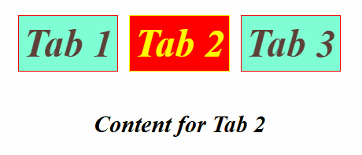

# 🚀 React Projects for Practice

This repository contains multiple **mini React.js projects** that demonstrate core React concepts such as state management, props, conditional rendering, API integration, and component reusability.  

Each project is built to strengthen React fundamentals and provide reusable UI components.

---

## 📌 Projects Overview

### 1. 🎵 Accordion Project
- Expand/collapse sections with single or multiple selections.  
- Great for FAQs and toggle-based content.  

---

### 2. 📑 Custom Tabs
- Tab navigation component with active/inactive states.  
- Switches between different content areas dynamically.  

---

### 3. 🖼️ Image Slider (with API)
- Fetches and displays images from an API.  
- Includes navigation arrows & indicators for a smooth slider experience.  

---

### 4. 🔲 Modal Popup
- Simple modal implementation in React.  
- Opens/closes dynamically based on user interaction.  

---

### 5. 📱 QR Code Generator
- Generates QR codes instantly from user input.  
- Uses external libraries for QR rendering.  

---

### 6. 🎨 Random Color Generator
- Generates random HEX/RGB colors.  
- Useful for testing UI color variations.  

---

### 7. 📜 Scroll Indicator
- Custom scroll progress bar built with React.  
- Shows scroll completion percentage.  

---

### 8. ⭐ Star Rating
- Interactive star rating component.  
- Useful for feedback/review systems.  

---

### 9. 🌗 Theme Changer
- Light/Dark mode toggler.  
- Demonstrates React state and conditional styling.  

---

### 10. 🌳 Tree View
- Expandable/collapsible tree structure.  
- Great for hierarchical data like menus and file explorers.  

---
### 11. 🧑‍💻 GitHub Profile Finder
- Search and fetch **GitHub user profiles** using the GitHub API.  
- Displays details like avatar, name, bio, followers, repositories, etc.  
- Default username is set to **Google** so the app loads instantly on start.  

---

## 🛠️ Tech Stack
- **React.js** (Functional Components + Hooks)  
- **CSS** for styling  
- **External APIs & libraries** (for QR codes, sliders, etc.)  

---

## 🎯 Purpose
These projects are designed to:
- Practice **React fundamentals**  
- Build **reusable UI components**  
- Improve **problem-solving skills in React**  
- Prepare for real-world React development  

---

## 📷 Demo Previews
GIFs and screenshots of each project are included inside this repo for quick reference.  

---

## 📜 License
This repository is open-source and available under the **MIT License**.
